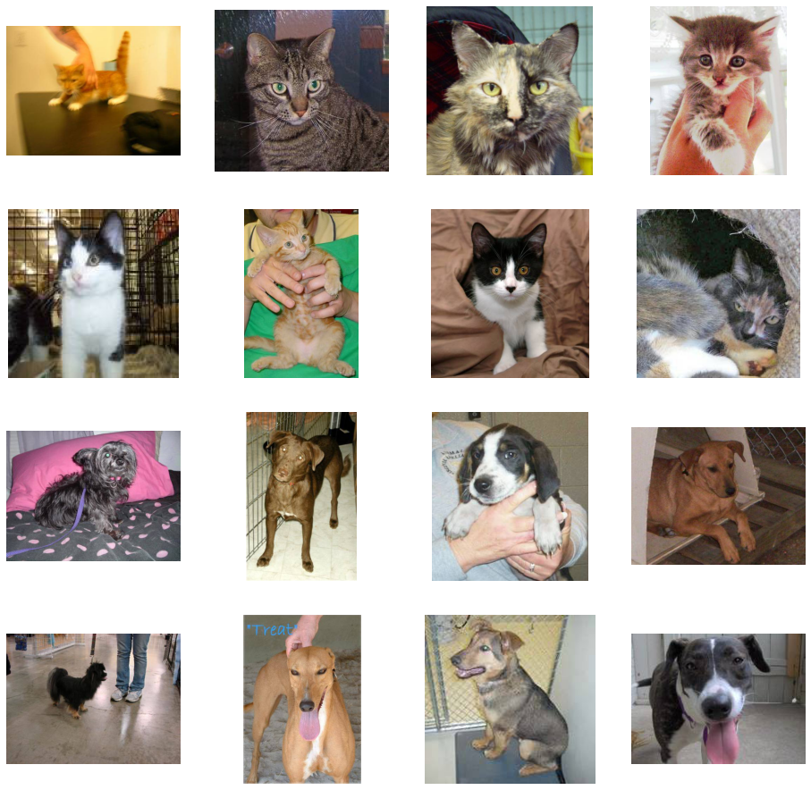
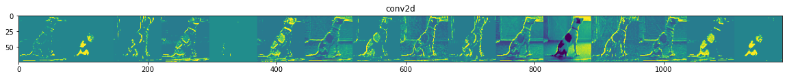
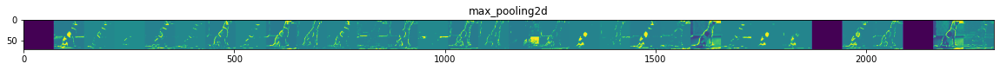
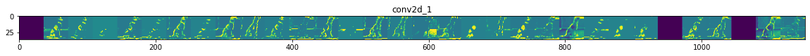
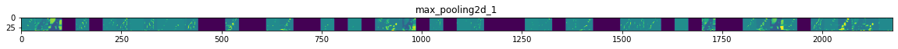
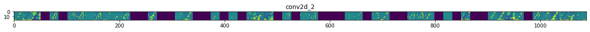
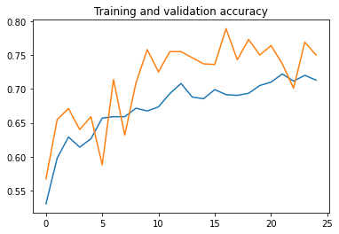
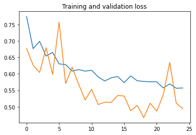

# Cats vs Dogs Classifier 

## Importing Packages 


```python
import os
import numpy as np
import matplotlib.pyplot as plt
import matplotlib.image as mpimg
```

## Data 


```python
base_dir = "D:\hrutik\Documents\Projects\Dataset\CatsandDogs"

train_dir = os.path.join(base_dir, 'train')
validation_dir = os.path.join(base_dir, 'validation')

# Directory with our training cat/dog pictures
train_cats_dir = os.path.join(train_dir, 'cats')
train_dogs_dir = os.path.join(train_dir, 'dogs')

# Directory with our validation cat/dog pictures
validation_cats_dir = os.path.join(validation_dir, 'cats')
validation_dogs_dir = os.path.join(validation_dir, 'dogs')

```


```python
train_cat_fnames = os.listdir( train_cats_dir )
train_dog_fnames = os.listdir( train_dogs_dir )

print(train_cat_fnames[:10])
print(train_dog_fnames[:10])
```

    ['cat.0.jpg', 'cat.1.jpg', 'cat.10.jpg', 'cat.100.jpg', 'cat.1000.jpg', 'cat.1001.jpg', 'cat.1002.jpg', 'cat.1003.jpg', 'cat.1004.jpg', 'cat.1005.jpg']
    ['dog.0.jpg', 'dog.1.jpg', 'dog.10.jpg', 'dog.100.jpg', 'dog.1000.jpg', 'dog.1001.jpg', 'dog.1002.jpg', 'dog.1003.jpg', 'dog.1004.jpg', 'dog.1005.jpg']
    


```python
print('total training cat images :', len(os.listdir(train_cats_dir ) ))
print('total training dog images :', len(os.listdir(train_dogs_dir ) ))

print('total validation cat images :', len(os.listdir( validation_cats_dir ) ))
print('total validation dog images :', len(os.listdir( validation_dogs_dir ) ))
```

    total training cat images : 10000
    total training dog images : 10000
    total validation cat images : 2500
    total validation dog images : 2500
    


```python
%matplotlib inline
nrows = 4
ncols = 4

pic_index = 0 
```


```python
fig = plt.gcf()
fig.set_size_inches(ncols*4, nrows*4)

pic_index+=8

next_cat_pix = [os.path.join(train_cats_dir, fname) 
                for fname in train_cat_fnames[ pic_index-8:pic_index] 
               ]

next_dog_pix = [os.path.join(train_dogs_dir, fname) 
                for fname in train_dog_fnames[ pic_index-8:pic_index]
               ]

for i, img_path in enumerate(next_cat_pix+next_dog_pix):
  sp = plt.subplot(nrows, ncols, i + 1)
  sp.axis('Off')

  img = mpimg.imread(img_path)
  plt.imshow(img)

plt.show()
```


    

    


```python
import tensorflow as tf
```

## CNN Model 


```python
model = tf.keras.models.Sequential([
    tf.keras.layers.Conv2D(16, (3,3), activation='relu', input_shape=(150, 150, 3)),
    tf.keras.layers.MaxPooling2D(2,2),
    tf.keras.layers.Conv2D(32, (3,3), activation='relu'),
    tf.keras.layers.MaxPooling2D(2,2), 
    tf.keras.layers.Conv2D(64, (3,3), activation='relu'), 
    tf.keras.layers.MaxPooling2D(2,2),
    tf.keras.layers.Flatten(), 
    tf.keras.layers.Dense(512, activation='relu'), 
    tf.keras.layers.Dense(1, activation='sigmoid')#output neuron is set to 1, since it will contain only 2 output. 0-Cats, 1-Dogs
])
```


```python
model.summary()
```

    Model: "sequential"
    _________________________________________________________________
    Layer (type)                 Output Shape              Param #   
    =================================================================
    conv2d (Conv2D)              (None, 148, 148, 16)      448       
    _________________________________________________________________
    max_pooling2d (MaxPooling2D) (None, 74, 74, 16)        0         
    _________________________________________________________________
    conv2d_1 (Conv2D)            (None, 72, 72, 32)        4640      
    _________________________________________________________________
    max_pooling2d_1 (MaxPooling2 (None, 36, 36, 32)        0         
    _________________________________________________________________
    conv2d_2 (Conv2D)            (None, 34, 34, 64)        18496     
    _________________________________________________________________
    max_pooling2d_2 (MaxPooling2 (None, 17, 17, 64)        0         
    _________________________________________________________________
    flatten (Flatten)            (None, 18496)             0         
    _________________________________________________________________
    dense (Dense)                (None, 512)               9470464   
    _________________________________________________________________
    dense_1 (Dense)              (None, 1)                 513       
    =================================================================
    Total params: 9,494,561
    Trainable params: 9,494,561
    Non-trainable params: 0
    _________________________________________________________________
    


```python
from tensorflow.keras.optimizers import RMSprop

model.compile(optimizer = RMSprop(lr = 0.001),
              loss = 'binary_crossentropy',
              metrics = ['accuracy'])
```


```python
from tensorflow.keras.preprocessing.image import ImageDataGenerator

train_datagen = ImageDataGenerator( rescale = 1.0/255.,
                                  rotation_range=40,
                                  width_shift_range=0.2,
                                  height_shift_range=0.2,
                                  shear_range=0.2,
                                  zoom_range=0.2,
                                  horizontal_flip=True,
                                  fill_mode='nearest')

# here we are appling some image augmentation parameters, so that our model can train better. 

test_datagen  = ImageDataGenerator( rescale = 1.0/255. )

train_generator = train_datagen.flow_from_directory(train_dir,
                                                    batch_size = 20,
                                                    class_mode = 'binary',
                                                    target_size = (150, 150))     

validation_generator =  test_datagen.flow_from_directory(validation_dir,
                                                         batch_size = 20,
                                                         class_mode = 'binary',
                                                         target_size = (150, 150))

```

    Found 20000 images belonging to 2 classes.
    Found 5000 images belonging to 2 classes.
    


```python
history = model.fit(train_generator,
                              validation_data = validation_generator,
                              steps_per_epoch = 100,
                              epochs = 25,
                              validation_steps = 50,
                              verbose = 2)
```

    Epoch 1/25
    100/100 - 91s - loss: 0.7740 - accuracy: 0.5305 - val_loss: 0.6766 - val_accuracy: 0.5670
    Epoch 2/25
    100/100 - 74s - loss: 0.6764 - accuracy: 0.5980 - val_loss: 0.6265 - val_accuracy: 0.6550
    Epoch 3/25
    100/100 - 63s - loss: 0.6987 - accuracy: 0.6290 - val_loss: 0.6039 - val_accuracy: 0.6710
    Epoch 4/25
    100/100 - 54s - loss: 0.6538 - accuracy: 0.6140 - val_loss: 0.6789 - val_accuracy: 0.6400
    Epoch 5/25
    100/100 - 49s - loss: 0.6650 - accuracy: 0.6265 - val_loss: 0.5982 - val_accuracy: 0.6590
    Epoch 6/25
    100/100 - 46s - loss: 0.6301 - accuracy: 0.6570 - val_loss: 0.7574 - val_accuracy: 0.5880
    Epoch 7/25
    100/100 - 44s - loss: 0.6280 - accuracy: 0.6590 - val_loss: 0.5702 - val_accuracy: 0.7140
    Epoch 8/25
    100/100 - 42s - loss: 0.6083 - accuracy: 0.6590 - val_loss: 0.6201 - val_accuracy: 0.6320
    Epoch 9/25
    100/100 - 43s - loss: 0.6128 - accuracy: 0.6715 - val_loss: 0.5685 - val_accuracy: 0.7090
    Epoch 10/25
    100/100 - 42s - loss: 0.6082 - accuracy: 0.6675 - val_loss: 0.5208 - val_accuracy: 0.7580
    Epoch 11/25
    100/100 - 41s - loss: 0.6108 - accuracy: 0.6735 - val_loss: 0.5531 - val_accuracy: 0.7250
    Epoch 12/25
    100/100 - 40s - loss: 0.5909 - accuracy: 0.6930 - val_loss: 0.5068 - val_accuracy: 0.7550
    Epoch 13/25
    100/100 - 40s - loss: 0.5783 - accuracy: 0.7080 - val_loss: 0.5140 - val_accuracy: 0.7550
    Epoch 14/25
    100/100 - 40s - loss: 0.5878 - accuracy: 0.6880 - val_loss: 0.5133 - val_accuracy: 0.7460
    Epoch 15/25
    100/100 - 40s - loss: 0.5919 - accuracy: 0.6855 - val_loss: 0.5342 - val_accuracy: 0.7370
    Epoch 16/25
    100/100 - 40s - loss: 0.5732 - accuracy: 0.6990 - val_loss: 0.5325 - val_accuracy: 0.7360
    Epoch 17/25
    100/100 - 36s - loss: 0.5937 - accuracy: 0.6915 - val_loss: 0.4878 - val_accuracy: 0.7890
    Epoch 18/25
    100/100 - 36s - loss: 0.5789 - accuracy: 0.6905 - val_loss: 0.5045 - val_accuracy: 0.7430
    Epoch 19/25
    100/100 - 36s - loss: 0.5769 - accuracy: 0.6935 - val_loss: 0.4672 - val_accuracy: 0.7730
    Epoch 20/25
    100/100 - 35s - loss: 0.5758 - accuracy: 0.7050 - val_loss: 0.5108 - val_accuracy: 0.7500
    Epoch 21/25
    100/100 - 35s - loss: 0.5757 - accuracy: 0.7100 - val_loss: 0.4863 - val_accuracy: 0.7640
    Epoch 22/25
    100/100 - 38s - loss: 0.5571 - accuracy: 0.7220 - val_loss: 0.5361 - val_accuracy: 0.7370
    Epoch 23/25
    100/100 - 36s - loss: 0.5694 - accuracy: 0.7115 - val_loss: 0.6346 - val_accuracy: 0.7010
    Epoch 24/25
    100/100 - 35s - loss: 0.5561 - accuracy: 0.7200 - val_loss: 0.5107 - val_accuracy: 0.7690
    Epoch 25/25
    100/100 - 37s - loss: 0.5570 - accuracy: 0.7130 - val_loss: 0.4945 - val_accuracy: 0.7500
    


```python
import numpy as np
import random
from   tensorflow.keras.preprocessing.image import img_to_array, load_img

successive_outputs = [layer.output for layer in model.layers[1:]]

#visualization_model = Model(img_input, successive_outputs)
visualization_model = tf.keras.models.Model(inputs = model.input, outputs = successive_outputs)

# Let's prepare a random input image of a cat or dog from the training set.
cat_img_files = [os.path.join(train_cats_dir, f) for f in train_cat_fnames]
dog_img_files = [os.path.join(train_dogs_dir, f) for f in train_dog_fnames]

img_path = random.choice(cat_img_files + dog_img_files)
img = load_img(img_path, target_size=(150, 150))  # this is a PIL image

x   = img_to_array(img)                           # Numpy array with shape (150, 150, 3)
x   = x.reshape((1,) + x.shape)                   # Numpy array with shape (1, 150, 150, 3)

x /= 255.0

successive_feature_maps = visualization_model.predict(x)

# These are the names of the layers, so can have them as part of our plot
layer_names = [layer.name for layer in model.layers]

for layer_name, feature_map in zip(layer_names, successive_feature_maps):
  
  if len(feature_map.shape) == 4:
        
    n_features = feature_map.shape[-1]  # number of features in the feature map
    size       = feature_map.shape[ 1]  # feature map shape (1, size, size, n_features)
    
    display_grid = np.zeros((size, size * n_features))
    
    for i in range(n_features):
      x  = feature_map[0, :, :, i]
      x -= x.mean()
      x /= x.std ()
      x *=  64
      x += 128
      x  = np.clip(x, 0, 255).astype('uint8')
      display_grid[:, i * size : (i + 1) * size] = x # Tile each filter into a horizontal grid

    scale = 20. / n_features
    plt.figure( figsize=(scale * n_features, scale) )
    plt.title ( layer_name )
    plt.grid  ( False )
    plt.imshow( display_grid, aspect='auto', cmap='viridis' ) 
```

    <ipython-input-13-9a27a62c422c>:39: RuntimeWarning: invalid value encountered in true_divide
      x /= x.std ()
    


    

    


    

    


    

    


    

    


    

    


## Plotting Accuracy and Loss


```python
acc      = history.history['accuracy']
val_acc  = history.history['val_accuracy']
loss     = history.history['loss']
val_loss = history.history['val_loss']

epochs   = range(len(acc)) #number of epochs

plt.plot  ( epochs,     acc )
plt.plot  ( epochs, val_acc )
plt.title ('Training and validation accuracy')
plt.figure()

plt.plot  ( epochs,     loss )
plt.plot  ( epochs, val_loss )
plt.title ('Training and validation loss'   )
```


    Text(0.5, 1.0, 'Training and validation loss')


    

    


    

    


```python

```
